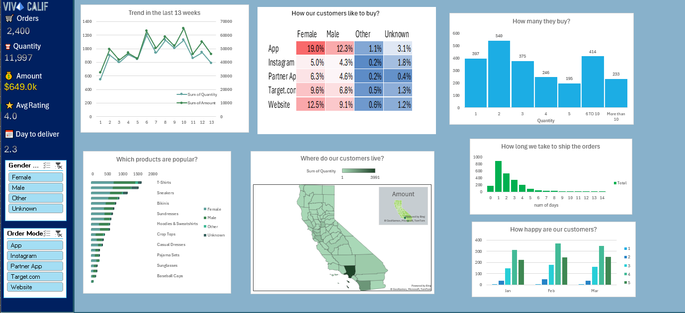

# Viva Calif Sales & Customer Insights Dashboard

A comprehensive sales performance and customer behavior analysis dashboard created entirely in **Microsoft Excel**. This project visualizes key business metrics to track trends, logistics, and customer satisfaction.
*Implementation based on the tutorial by [Chandoo](https://youtu.be/l5qkg8gzY6E?si=jrwg0XdTqDd97JW7).*
## Key Insights & Visuals
- **Sales Performance:** Tracking orders (2,400), total quantity (11,997), and revenue ($649.0k).
- **Trend Analysis:** 13-week trend tracking for both order quantity and total amount.
- **Customer Demographics:** Heatmap analysis of buying preferences across different platforms (App, Instagram, Website, etc.) segmented by gender.
- **Product Popularity:** Stacked bar charts showing top-performing products (T-Shirts, Sneakers, etc.) by customer segment.
- **Logistics & Satisfaction:** Monitoring shipping duration (averaging 2.3 days) and monthly customer rating distributions.
- **Geographic Distribution:** Map visualization showing customer density by region.

## Technical Features
- **Interactive Slicers:** Dynamic filtering by Gender and Order Mode.
- **Advanced Formatting:** Custom UI design within Excel for a clean, professional dashboard feel.
- **Data Modeling:** Efficient organization of raw data to support complex visual relationships.

---

## Preview

---

## Tools Used
- **Microsoft Excel:** Data processing, Pivot Tables, and Dashboard Design.
